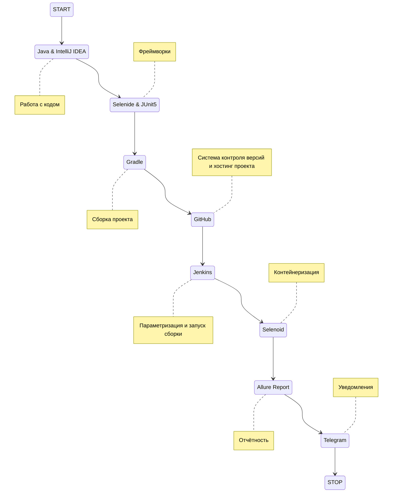

```mermaid        
    stateDiagram-v2
        State1: START
        State2: Java & IntelliJ IDEA
        State3: Selenide & JUnit5
        State4: Gradle
        State5: GitHub
        State6: Jenkins
        State7: Selenoid
        State8: Allure Report
        State9: Telegram
        State10: STOP
        State1 --> State2
        State2 --> State3
        State3 --> State4
        State4 --> State5
        State5 --> State6
        State6 --> State7
        State7 --> State8
        State8 --> State9
        State9 --> State10
        note right of State2 : Работа с кодом
        note left of State3 : Фреймворки
        note right of State4 : Сборка проекта
        note left of State5 : Система контроля версий и хостинг проекта
        note right of State6 : Параметризация и запуск сборки
        note left of State7 : Контейнеризация
        note right of State8 : Отчётность
        note left of State9 : Уведомления
```
