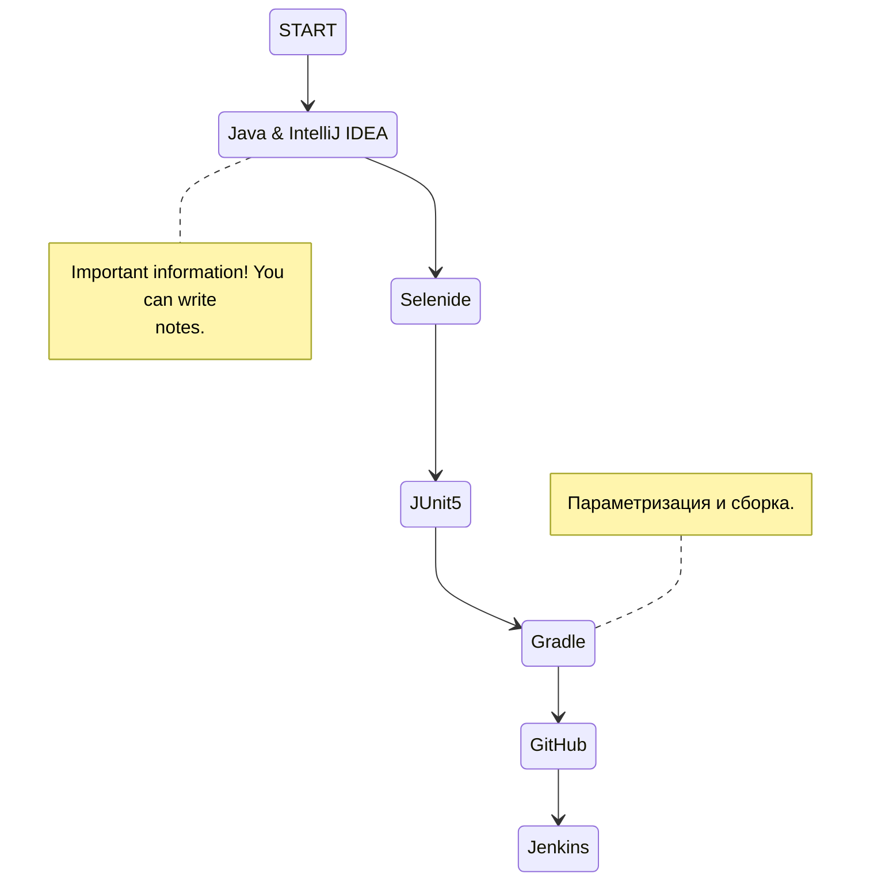

```mermaid        
    stateDiagram-v2
        State1: START
        State2: Java & IntelliJ IDEA
        State3: Selenide
        State4: JUnit5
        State5: Gradle
        State6: GitHub
        State7: Jenkins
        State1 --> State2
        State2 --> State3
        State3 --> State4
        State4 --> State5
        State5 --> State6
        State6 --> State7
        note right of State2
            Important information! You can write
            notes.
        end note
        note left of State5 : Параметризация и сборка.
```
