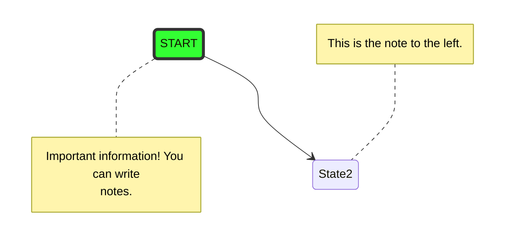

```mermaid        
    stateDiagram-v2
    classDef class1 fill:#3f3,stroke:#333,stroke-width:4px
    classDef class2 fill:#ff2400,stroke:#333,stroke-width:4px,color:#fff,stroke-dasharray: 12 5
    classDef class3 fill:#00fff2,stroke:#333,stroke-width:4px
    
        State1: START
        note right of State1
            Important information! You can write
            notes.
        end note
        State1:::class1 --> State2
        note left of State2 : This is the note to the left.
```
