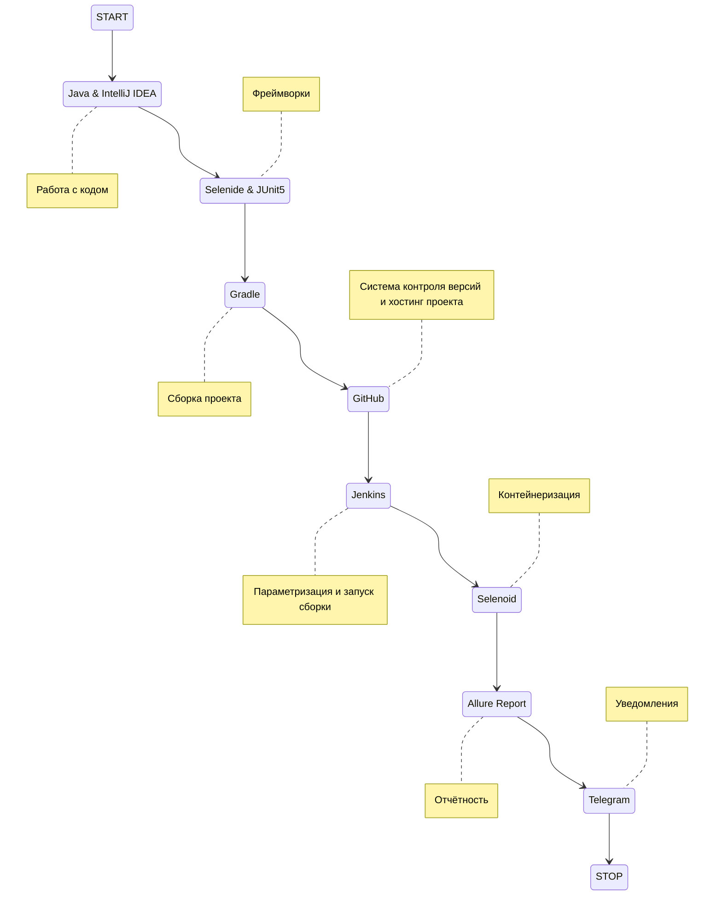
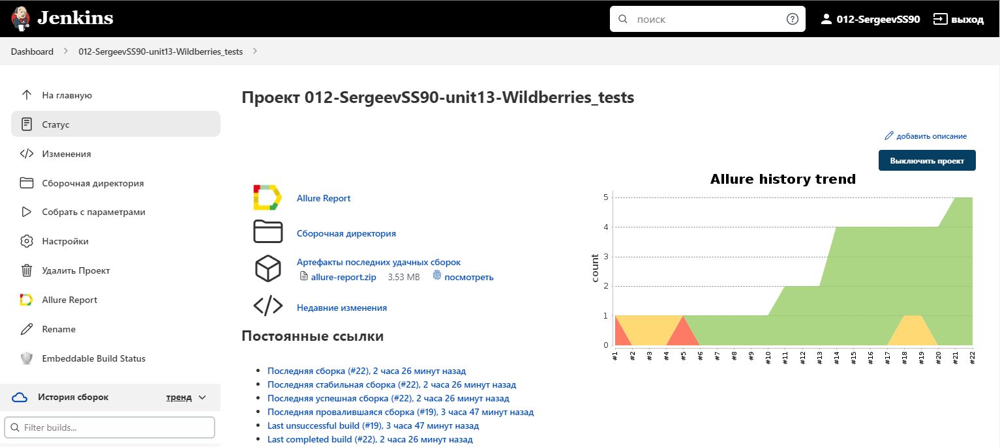
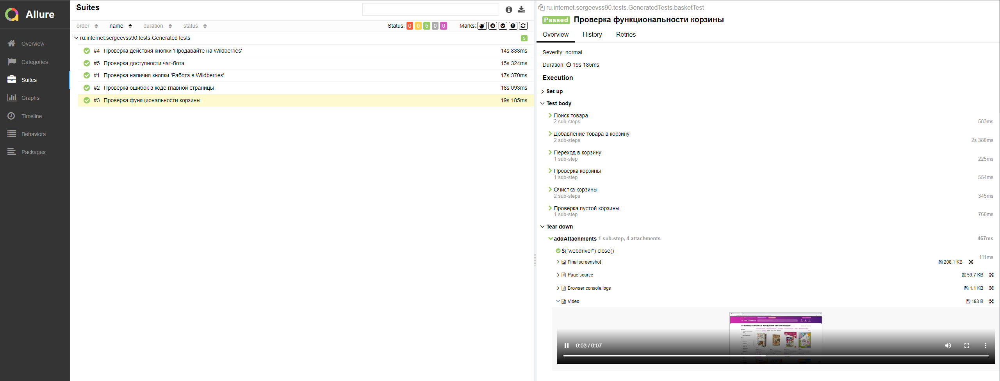
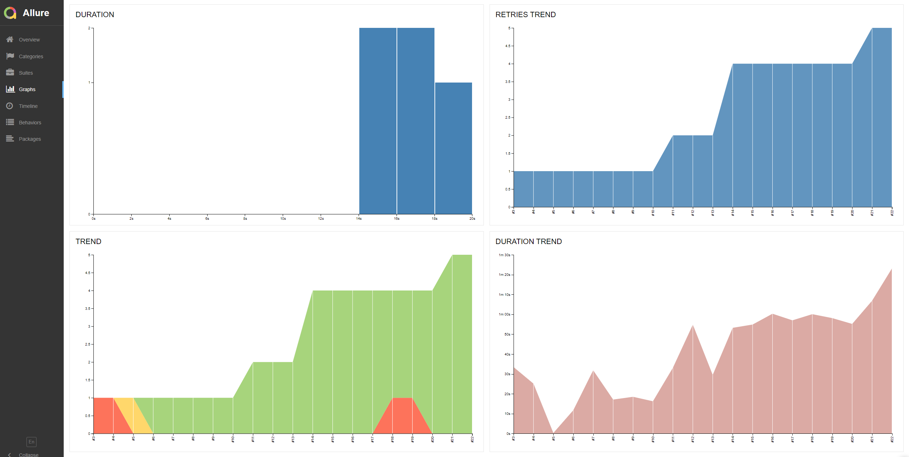

# Автоматизированное тестирование сайта Wildberries

## :page_with_curl:    Содержание

➠ [Покрытый функционал](#globe_with_meridians-покрытый-функционал)

➠ [Технологический стек](#computer-технологический-стек)

➠ [Запуск тестов из терминала](#technologist-запуск-тестов-из-терминала)

➠ [Удаленный запуск тестов](#удаленный-запуск-тестов)

➠ [Сборка в Jenkins](#-главная-страница-сборки-Jenkins)

➠ [Отчет о результатах тестирования в Allure Report](#-отчет-о-результатах-тестирования-в-allure-report)

➠ [Уведомления в Telegram с использованием бота](#-уведомления-в-telegram-с-использованием-бота)

➠ [Пример запуска теста в Selenoid](#-пример-запуска-теста-в-selenoid)
## <a name="globe_with_meridians-покрытый-функционал"></a>:globe_with_meridians: Покрытый функционал

### UI

- [x] Проверка отсутствия ошибок в журнале консоли главной страницы
- [x] Проверка функциональности корзины (добавление-удаление товара)
- [x] Проверка наличия кнопки 'Работа в Wildberries'
- [x] Проверка действия кнопки 'Продавайте на Wildberries'
- [x] Проверка доступности чат-бота

## :computer: Технологический стек

<p align="center">


</p>


## :technologist: Запуск тестов из терминала

### Локальный запуск тестов

```
gradle clean test
```

### Удаленный запуск тестов

```
clean
test
-Dbrowser=${BROWSER}
-Dsize=${SIZE}
```

### Параметры сборки

> <code>BROWSER</code> – браузер, в котором будут выполняться тесты (_по умолчанию - <code>chrome</code>_).
>
> <code>BROWSER_SIZE</code> – размер окна браузера, в котором будут выполняться тесты (_по умолчанию - <code>1920x1080</code>_).
> 
> <code>ENVIRONMENT</code> – версия окружения для отчёта в Telegram.
> 
> <code>PROJECT_NAME</code> – имя проекта для отчёта в Telegram.

##  Главная страница сборки [Jenkins](https://jenkins.autotests.cloud/job/012-SergeevSS90-unit13-Wildberries_tests/)

<p align="center">
  
</p>

##  Отчет о результатах тестирования в [Allure Report](https://jenkins.autotests.cloud/job/012-SergeevSS90-unit13-Wildberries_tests/24/allure/)

### :pushpin: Главная страница Allure-отчета

<p align="center">

</p>

### :pushpin: Страница с тестами

<p align="center">

</p>

### :pushpin: Основной дашборд

<p align="center">

</p>
